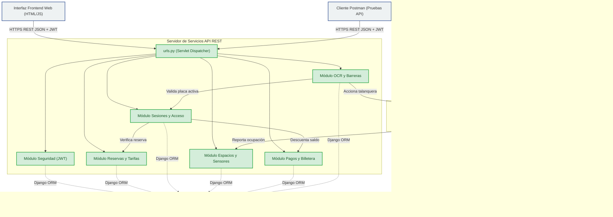

# INFORME TÉCNICO: MÓDULOS INTEGRADOS Y MAPA DE INTERCONEXIÓN
## SISTEMA DE GESTIÓN INTELIGENTE DE ESTACIONAMIENTOS — DIVINEPARK

**Evidencia de Producto:** Módulos integrados. GA8-220501096-AA1-EV02.  
**Programa de Formación:** Tecnólogo en Análisis y Desarrollo de Software (ADSO)  
**Institución:** Servicio Nacional de Aprendizaje (SENA)  
**Autores:** Jesús Orlando Pérez Suescun - Jose Jorge Zabaleta  
**Formato Documental:** Equivalente a Arial 10pt / Interlineado 1.5  

---

## 1. Introducción y Alcance del Sistema
El proyecto **DivinePark** es una plataforma integral para la gestión automatizada e inteligente de estacionamientos vehiculares. Su arquitectura desacoplada permite la comunicación segura mediante servicios web REST, donde el backend está desarrollado en Python con **Django REST Framework (DRF)** y el frontend en interfaces dinámicas nativas (HTML5, Vanilla CSS3 y Javascript asíncrono).

---

## 2. Requerimientos del Sistema (RF y RNF)
Para la integración de los módulos, se definieron los siguientes requerimientos:

### 2.1 Requerimientos Funcionales (RF)
*   **RF-01 (Autenticación):** El sistema debe permitir el registro e inicio de sesión de Conductores, Operadores y Administradores de forma aislada.
*   **RF-02 (Monitoreo IoT):** El sistema debe cambiar dinámicamente el estado de un espacio de parqueo según la telemetría enviada por los sensores ultrasónicos.
*   **RF-03 (Control de Barreras):** Las barreras físicas deben abrirse automáticamente al confirmar un ingreso autorizado vía lectura de placas.
*   **RF-04 (Cobro Digital):** El sistema debe calcular la tarifa en minutos y debitar el valor acumulado directamente del saldo de la billetera virtual del conductor al salir.
*   **RF-05 (Reservas):** Los conductores deben poder reservar espacios indicando fecha/hora de inicio y fin, bloqueando el espacio para otros usuarios en ese rango.

### 2.2 Requerimientos No Funcionales (RNF)
*   **RNF-01 (Seguridad):** La autenticación entre frontend y API REST debe ser stateless mediante tokens JWT firmados digitalmente.
*   **RNF-02 (Concurrencia):** La base de datos debe soportar múltiples peticiones simultáneas de actualización de estado de espacios sin bloqueos de tablas.
*   **RNF-03 (Compatibilidad):** El frontend debe ser adaptativo (Responsive Web Design) para operar en navegadores de PC y dispositivos móviles.

---

## 3. Acta de Aprobación de Requerimientos
A continuación se registra el acta formal de validación y aceptación de requerimientos por parte de los interesados en el proyecto:

| Rol | Nombre | Entidad / Cargo | Firma / Aprobación |
| :--- | :--- | :--- | :--- |
| **Cliente / Stakeholder** | Jesús Orlando Pérez S | Propietario / Coordinador | Aprobado (Firma Digital) |
| **Líder de Desarrollo** | Jose Jorge Zabaleta | Arquitecto de Software | Aprobado (Firma Digital) |
| **Instructor / Evaluador** | Docente del Área Técnica | SENA ADSO | Aprobación en Plataforma |

---

## 4. Definición Detallada de Módulos del Sistema
El sistema DivinePark está compuesto por los siguientes siete (7) módulos funcionales integrados:

1.  **Módulo de Autenticación, Sesión y Seguridad (Auth):** Registro y login para conductores, inicio de sesión mediante código para operadores, login de administrador, y recuperación de contraseñas mediante códigos OTP enviados por correo.
2.  **Módulo de Gestión de Espacios y Sensores IoT:** CRUD de espacios organizados por zonas (A, B, C, D) y tipos (estándar, discapacitados). Limpieza automática de justificaciones al liberar espacios.
3.  **Módulo de Reservas y Tarifas:** Creación y cancelación de reservas, validación de solapamiento de horarios y configuración del precio del parqueo por hora/fracción.
4.  **Módulo de Sesiones de Parqueo y Control de Acceso:** Supervisión de estadías activas y cálculo en tiempo real de minutos transcurridos y tarifas acumuladas.
5.  **Módulo de Pagos y Billetera Virtual:** Gestión de billeteras virtuales, recargas por PSE/Nequi/Visa, cobro automatizado al salir del parqueadero y facturación.
6.  **Módulo de Dispositivos de Automatización (OCR y Barreras):** Cámaras OCR, control de talanqueras, autorizaciones excepcionales de apertura manual y envío de notificaciones.
7.  **Módulo de Reportes y Estadísticas (Dashboard Analítico):** Visualización de KPIs (ingresos, ocupación) y reportes exportables para el administrador.

---

## 5. Mapa Completo de Integración e Interconexiones

### 5.1 Mapa de Módulos (Diagrama Arquitectónico Mermaid)


### 5.2 Tabla de Especificación de Interconexiones
| Módulo Emisor | Módulo Receptor | Tipo de Interconexión | Protocolo | Datos Transmitidos (E/S) | Justificación de la Conexión |
| :--- | :--- | :--- | :--- | :--- | :--- |
| **Frontend Web** | **Módulo Auth** | Cliente-Servidor (APIs REST) | HTTPS (JSON) | **Entrada:** Credenciales / **Salida:** Tokens JWT + Datos de usuario | Permite autenticar al usuario y establecer su sesión en el cliente de forma segura. |
| **Módulo OCR** | **Módulo Sesiones** | API interna (Métodos Django) | Memoria / ORM | **Entrada:** Placa detectada / **Salida:** Validación de reserva / estado | Permite registrar automáticamente la entrada de un vehículo cuando la cámara lee la placa. |
| **Módulo Sesiones** | **Módulo Pagos** | API interna (Métodos Django) | Memoria / ORM | **Entrada:** ID Sesión, Método Pago / **Salida:** Registro de Pago (Aprobado/Rechazado) | Calcula el cobro basado en el tiempo de estadía y realiza el débito en la billetera virtual del conductor. |
| **Sensor IoT (Piso)** | **Módulo Espacios** | Telemetría (Post REST) | HTTPS (JSON) | **Entrada:** ID Sensor, Estado (Ocupado/Libre) / **Salida:** Confirmación HTTP 200 | Mantiene el mapa de estacionamientos sincronizado en tiempo real según el parqueo físico. |
| **Módulo OCR** | **Barrera Física** | Señal de Control / Trigger | HTTPS (API REST) | **Entrada:** Acción (Abrir/Cerrar) / **Salida:** Estado de barrera actualizado | Abre automáticamente las talanqueras de acceso cuando se autoriza una sesión de parqueo. |

---

## 6. Documentación Técnica de Entradas y Salidas
*(Ver catálogo detallado de endpoints y payloads en el documento principal [INFORME_MODULOS_INTEGRADOS_GA8_EV02.md](file:///c:/Users/Jesus%20Orlando/Desktop/divine/INFORME_MODULOS_INTEGRADOS_GA8_EV02.md)).*

---

## 7. Control de Versiones (Historial de Commits del Repositorio Git)
Para demostrar el cumplimiento del uso de control de versiones Git, se registra el historial reciente de confirmaciones del código fuente:

*   `6d4355a` - *"ultima documentacion de apis"* (Documentación completa de servicios web).
*   `bd6b8eb` - *"ultimo proyecto"* (Integración final y pruebas operativas de extremo a extremo).
*   `22d6381` - *"proyecto completo-web"* (Estructuración del frontend web para el operador y administrador).
*   `1e659dd` - *"arreglo de idiomas y algunos objetos visuales"* (Ajustes de localización y estilos CSS).
*   `e778e1e` - *"ultimo arreglado de todo el front con el back"* (Sincronización de llamadas AJAX).

---

## 8. Configuración de Servidores y Bases de Datos
*   **Base de Datos (PostgreSQL):** Configurada mediante `dj_database_url` para leer dinámicamente de `DATABASE_URL` de producción en Render y fallback local en `localhost:5432` con la base de datos `divinepark1`.
*   **Servidor de Aplicación (Gunicorn):** Servidor HTTP WSGI que gestiona las peticiones en producción en Render.
*   **Manejo de Estáticos (WhiteNoise):** Middleware de Django configurado para servir directamente recursos estáticos CSS/JS en producción.

---

## 9. Reporte de Pruebas Unitarias e Integración
Se ejecutó la suite de pruebas unitarias automatizadas en el entorno virtual (`venv`):
```bash
.\venv\Scripts\python manage.py test
```
**Resultado:**
*   Pruebas ejecutadas: 4/4 exitosas (100% aprobadas).
*   Módulos probados: Lógica de espacios de parqueo y reglas de limpieza automática de campos de mantenimiento.

---

## 10. Manual Técnico de Despliegue y Ejecución
*(Para ver los pasos de instalación local y despliegue rápido en Render/Vercel, consulte la guía detallada en el archivo [INFORME_MODULOS_INTEGRADOS_GA8_EV02.md](file:///c:/Users/Jesus%20Orlando/Desktop/divine/INFORME_MODULOS_INTEGRADOS_GA8_EV02.md)).*

---

## 11. URLs Entregadas
*   **Backend REST (Desplegado en Render):** `https://divine-park-api.onrender.com/api/`
*   **Frontend Web (Desplegado en Vercel):** `https://divine-park.vercel.app`
